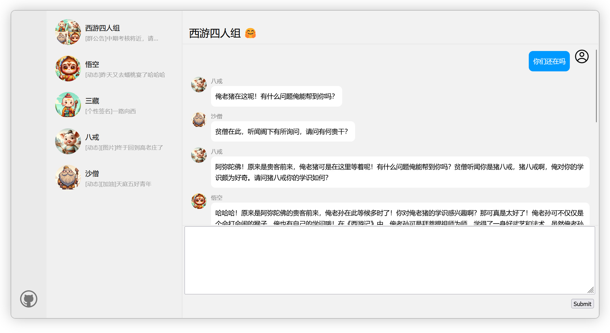

# XiYou-Chatroom-前端



这是一个使用 [`create-next-app`](https://github.com/vercel/next.js/tree/canary/packages/create-next-app) 启动的 [Next.js](https://nextjs.org/) 项目。

<div align="center">

[English](README.md) | 简体中文

</div>

## 开始

首先，您需要安装 Node.js。Node.js 是一个运行在服务器端的 JavaScript 环境。这个项目需要 Node.js 才能运行。

### 安装 Node.js

访问 [Node.js 官网](https://nodejs.org/) 并下载适合您操作系统的版本。网站上提供了安装指南。安装完成后，您可以在命令行中运行 `node -v` 来检查安装是否成功，它应该会返回当前安装的 Node.js 版本。

### 运行开发服务器

安装完 Node.js 后，通过以下命令启动开发服务器：

```bash
npm run dev
# 或
yarn dev
# 或
pnpm dev
# 或
bun dev
```

使用浏览器打开 [http://localhost:3000](http://localhost:3000) 查看结果。

您可以通过修改 `app/page.js` 来开始编辑页面。文件会随着您的编辑自动更新。

这个项目使用 [`next/font`](https://nextjs.org/docs/basic-features/font-optimization) 来自动优化和加载 Inter 字体，这是一个自定义的 Google 字体。

## 学习更多

要了解更多关于 Next.js 的信息，请参阅以下资源：

- [Next.js 文档](https://nextjs.org/docs) - 了解 Next.js 的特性和 API。
- [学习 Next.js](https://nextjs.org/learn) - 一个交互式的 Next.js 教程。

您可以查看 [Next.js GitHub 仓库](https://github.com/vercel/next.js/) - 欢迎提供反馈和贡献！

## 在 Vercel 上部署

将您的 Next.js 应用部署到 [Vercel 平台](https://vercel.com/new?utm_medium=default-template&filter=next.js&utm_source=create-next-app&utm_campaign=create-next-app-readme) 是最简单的方法，这是 Next.js 的创造者推出的平台。

查看我们的 [Next.js 部署文档](https://nextjs.org/docs/deployment) 了解更多详情。
